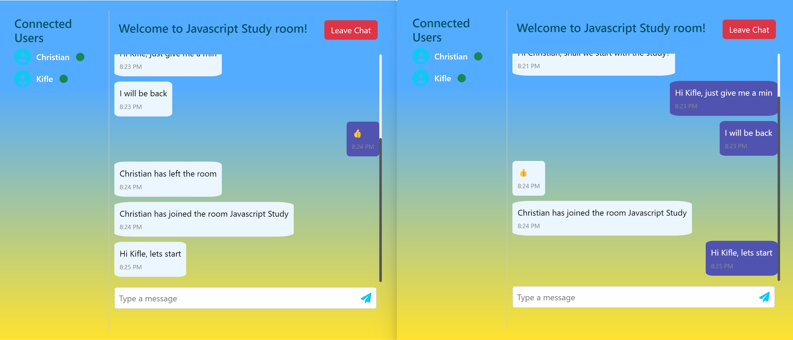

<a name="readme-top"></a>

<div align="center">
  
  <h1><b>Chat - App</b></h1>
</div>
<div align="center">
  
</div>

# 📗 Table of Contents

- [📖 About the Project](#about-project)
  - [🛠 Built With](#built-with)
    - [Tech Stack](#tech-stack)
    <!-- - [Key Features](#key-features) -->
  - [🚀 Live Demo](#live-demo)
- [💻 Getting Started](#getting-started)
  - [Setup](#setup)
  - [Prerequisites](#prerequisites)
  <!-- - [Install](#install)
  - [Usage](#usage)
  - [Deployment](#triangular_flag_on_post-deployment)-->
- [👥 Authors](#authors)
- [🤝 Contributing](#contributing)
- [⭐️ Show your support](#support)
- [🔭 Acknowledgements](#acknowledgements)
- [📝 License](#license)

<!-- PROJECT DESCRIPTION -->

# 🎯 Chat App<a name="about-project"></a>

> This App is created to exercise SignalR.

## 🛠 Built With <a name="built-with"></a>

### Tech Stack <a name="tech-stack"></a>

<details>
  <summary>Technology</summary>
  <ul>
    <li>Angular</li>
    <li>Bootstrap 5</li>
    <li>SignalR</li>
    <li>.NET 7</li>
  </ul>
</details>

<details>
  <summary>Tools</summary>
  <ul>
    <li>VS Code</li>
    <li>Visual Studio Community 2022</li>
    <li>Git</li>
  </ul>
</details>

<p align="right">(<a href="#readme-top">back to top</a>)</p>

LIVE DEMO

## 🚀 Live Demo <a name="live-demo"></a>

- [Live Demo Link](https://chatapp-signalr.web.app)

<p align="right">(<a href="#readme-top">back to top</a>)</p>

<!-- GETTING STARTED -->

## 💻 Getting Started <a name="getting-started"></a>

To get a local copy up and running follow these simple example steps.

### Prerequisites

you have to those tools in your local machine.

- [ ] NPM
- [ ] GIT & GITHUB
- [ ] Any Code Editor (VS Code, Visual Studio 2022, Brackets, etc)

### Setup

Clone the project.

```bash
  git clone https://github.com/kifle23/group-chat.git
```

Go to the project directory.

```bash
  cd group-chat
```

In the project directory, you can run:

```bash
  ng serve
```

Runs the app in the development mode.
1. Run API
2. Open [http://localhost:4200](http://localhost:4200) to view it in your browser.

The page will reload when you make changes.

<p align="right">(<a href="#readme-top">back to top</a>)</p>

<!-- AUTHORS -->

## 👥 Authors <a name="authors"></a>

### Author:

👤 **Kifle Haile**

- GitHub: [@githubhandle](https://github.com/kifle23)
- Twitter: [@twitterhandle](https://twitter.com/KifleHaile12)
- LinkedIn: [LinkedIn](https://www.linkedin.com/in/kifle-haile)
<p align="right">(<a href="#readme-top">back to top</a>)</p>

<!-- CONTRIBUTING -->

## 🤝 Contributing <a name="contributing"></a>

Contributions, issues, and feature requests are welcome!

Feel free to check the [issues page](https://github.com/kifle23/group-chat/issues).

<p align="right">(<a href="#readme-top">back to top</a>)</p>

<!-- SUPPORT -->

## 👋 Show your support <a name="support"></a>

Give a ⭐️ if you like this project!

<p align="right">(<a href="#readme-top">back to top</a>)</p>

<!-- ACKNOWLEDGEMENTS -->

## 🔭Acknowledgments <a name="acknowledgements"></a>

- [Microverse](https://www.microverse.org/).
- [Letsprogram](https://letsprogram.in/home)

<p align="right">(<a href="#readme-top">back to top</a>)</p>

## 📝 License <a name="license"></a>

This project is [MIT](./LICENSE) licensed.

<p align="right">(<a href="#readme-top">back to top</a>)</p>
